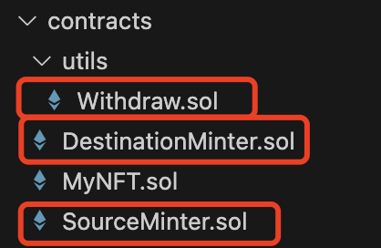
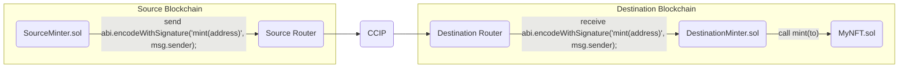

# CCIP Cross Chain NFT

This project demonstrates how to mint an NFT on one blockchain from another blockchain using Chainlink CCIP.

This project consists of four contracts: Withdraw, SourceMinter, DestinationMinter, and MyNFT. The SourceMinter contract is used to transfer assets between blockchains and pay corresponding fees, while the DestinationMinter contract is used to receive cross-chain messages and execute corresponding operations, such as creating non-fungible tokens (NFTs) on the blockchain. The MyNFT contract represents a custom NFT token.

By leveraging Chainlink interfaces and routers, the contracts enable cross-chain communication and payment functions, as well as the creation and transfer of NFTs between different blockchains. This project demonstrates the flexibility and versatility of smart contracts in enabling inter-blockchain asset transfer, message passing, and token creation.

## About Chainlink's Contract



### Withdraw.sol

This Solidity smart contract code defines a contract named `Withdraw`, which inherits from the `OwnerIsCreator` contract, usually related to the Chainlink Contract Compatibility Interface. The `Withdraw` contract includes two functions: `withdraw` and `withdrawToken`, both of which allow the contract owner to extract assets from the contract.
1. `withdraw` function: This function allows the contract owner to withdraw Ethereum (ETH) from the contract to a specified beneficiary address. First, it retrieves the contract's current ETH balance, then attempts to send all the balance to the beneficiary address. If the transfer fails, the contract will execute a rollback transaction and report an error, with the error message being `FailedToWithdrawEth`, including the initiator's address, beneficiary address, and the amount of ETH attempted to be withdrawn.
2. `withdrawToken` function: This function allows the contract owner to withdraw ERC20 standard tokens from the contract to a specified beneficiary address. The function takes two parameters: the beneficiary address and the token contract address. First, it queries the contract's token balance, then sends all the tokens to the beneficiary address by calling the token contract's `transfer` function.
Both functions are preceded by the `onlyOwner` modifier, which means only the contract owner can call these functions. The purpose of this contract is to allow the owner to extract assets from the contract as needed, whether it's ETH or ERC20 tokens.

### SourceMinter.sol

This Solidity smart contract code defines a contract named `SourceMinter` that inherits from the `Withdraw` contract. The `SourceMinter` contract is mainly used for transferring assets between blockchains and paying the corresponding fees. The contract includes an enumeration type `PayFeesIn` to specify the token type used to pay fees.
1. Contract Constructor: When the contract is created, it receives two parameters: `router` and `link`, which represent the contract addresses of the router and Chainlink token (LINK), respectively. Then, by calling the `approve` function of `LinkTokenInterface`, it allows the router to withdraw any amount of Chainlink tokens from the contract.
2. `receive` function: This is an external payable function that allows the contract to receive Ethereum (ETH).
3. `mint` function: This function is used to create assets on the specified blockchain and pay the corresponding fees. The function receives three parameters: `destinationChainSelector` (the selector of the target blockchain), `receiver` (the receiver's address), and `payFeesIn` (the token type used to pay fees). The function first creates a `Client.EVM2AnyMessage` type message containing the receiver's address, call signature, token amounts, and extra arguments. Then, it retrieves the corresponding fee based on the token type used to pay the fee from the router. Next, according to the fee type, it uses the `ccipSend` function of `IRouterClient` to send the message to the target blockchain. Finally, it triggers a `MessageSent` event using the `emit` keyword, sending the message ID to the blockchain.
In summary, the `SourceMinter` contract is used to transfer assets between blockchains and pay the corresponding fees. It uses Chainlink interfaces and routers to achieve cross-chain communication and payment functions.

### DestinationMinter.sol


This Solidity smart contract code defines a contract named `DestinationMinter` that inherits from the `CCIPReceiver` contract. The `DestinationMinter` contract is mainly used for receiving cross-chain messages and executing corresponding operations, such as creating non-fungible tokens (NFTs) on the blockchain.
1. Contract Constructor: When the contract is created, it receives two parameters: `router` and `nftAddress`, which represent the contract addresses of the router and custom NFT contract, respectively. Then, by calling the `MyNFT` constructor, it creates a `MyNFT` instance and assigns it to the `nft` variable.
2. `MintCallSuccessfull` event: This is a custom event used to trigger when creating NFTs successfully.
3. `_ccipReceive` function: This is an internal override function used to receive cross-chain messages. The function receives a `Client.Any2EVMMessage` type message containing the data to be called. The function first executes the data in the message by calling `address(nft).call(message.data)`. Then, it ensures the call is successful by using `require(success);`. If the call is successful, it triggers the `MintCallSuccessfull` event.
In summary, the `DestinationMinter` contract is used to receive cross-chain messages and create NFTs on the target blockchain. It uses Chainlink interfaces and routers to implement cross-chain communication and NFT creation functions.


## Prerequisites

- [Git](https://git-scm.com/book/en/v2/Getting-Started-Installing-Git)
- [Current LTS Node.js version](https://nodejs.org/en/about/releases/)

Verify installation by typing:

```shell
node -v
```

and

```shell
npm -v
```

## Getting Started

1. Install packages

```
npm install
```

2. Compile contracts

```
npx hardhat compile
```

3. Compile project

```
npm run build
```

## What is Chainlink CCIP?

**Chainlink Cross-Chain Interoperability Protocol (CCIP)** provides a single, simple, and elegant interface through which dApps and web3 entrepreneurs can securely meet all their cross-chain needs, including token transfers and arbitrary messaging.


With Chainlink CCIP, one can:

- Transfer supported tokens
- Send messages (any data)
- Send messages and tokens

CCIP receiver can be:

- Smart contract that implements `CCIPReceiver.sol`
- EOA

**Note**: If you send a message and token(s) to EOA, only tokens will arrive

To use this project, you can consider CCIP as a "black-box" component and be aware of the Router contract only. If you want to dive deep into it, check the [Official Chainlink Documentation](https://docs.chain.link/ccip).

## What are we building?

Imagine that you want to go to a conference that sells tickets as NFTs on one chain, but you have funds on some other chain. You will need to bridge your tokens to that chain where the NFT contract exists, to mint the NFT, and optionally bridge funds back.

We are building the cross-chain NFT minting system. This project aims to mint an NFT on the destination blockchain by sending the `to` address from the source blockchain. It is extremely simple so we can understand the basic concepts, but you can expand it to accept payment for minting on the source blockchain, add extra features, etc.

The basic architecture diagram of what we want to accomplish looks like this:



## Usage

There are several Hardhat tasks available for deployment and interaction with this project. But before that, you need to set up some environment variables.

We are going to use the [`@chainlink/env-enc`](https://www.npmjs.com/package/@chainlink/env-enc) package for extra security. It encrypts sensitive data instead of storing them as plain text in the `.env` file, by creating a new, `.env.enc` file. Although it's not recommended to push this file online, if that accidentally happens your secrets will still be encrypted.

1. Set a password for encrypting and decrypting the environment variable file. You can change it later by typing the same command.

```shell
npx env-enc set-pw
```

2. Now set the following environment variables: `PRIVATE_KEY`, Source Blockchain RPC URL, Destination Blockchain RPC URL. You can see available options in the `.env.example` file:

```shell
ETHEREUM_SEPOLIA_RPC_URL=""
OPTIMISM_GOERLI_RPC_URL=""
ARBITRUM_TESTNET_RPC_URL=""
AVALANCHE_FUJI_RPC_URL=""
POLYGON_MUMBAI_RPC_URL=""
```

To set these variables, type the following command and follow the instructions in the terminal:

```shell
npx env-enc set
```

After you are done, the `.env.enc` file will be automatically generated.

If you want to validate your inputs you can always run the next command:

```shell
npx env-enc view
```

### Deployment

1. Deploy the [`MyNFT.sol`](./contracts/cross-chain-nft-minter/MyNFT.sol) and [`DestinationMinter.sol`](./contracts/cross-chain-nft-minter/DestinationMinter.sol) smart contracts to the **destination blockchain**, by running the `deploy-destination-minter` task:

```shell
npx hardhat deploy-destination-minter
--router <routerAddress> # Optional
```

For example, if you want to mint NFTs on avalancheFuji, run:

```shell
npx hardhat deploy-destination-minter --network avalancheFuji
```

2. Deploy the [`SourceMinter.sol`](./contracts/cross-chain-nft-minter/SourceMinter.sol) smart contract to the **source blockchain**, by running the `deploy-source-minter` task:

```shell
npx hardhat deploy-source-minter
--router <routerAddress> # Optional
--link <linkTokenAddress> # Optional
```

For example, if you want to mint NFTs on avalancheFuji by sending requests from ethereumSepolia, run:

```shell
npx hardhat deploy-source-minter --network ethereumSepolia
```

### Fee Management

3. Fund the [`SourceMinter.sol`](./contracts/cross-chain-nft-minter/SourceMinter.sol) smart contract with tokens for CCIP fees.

- If you want to pay for CCIP fees in Native tokens:

  Open Metamask and fund your contract with Native tokens. For example, if you want to mint from Ethereum Sepolia to Avalanche Fuji, you can send 0.01 Sepolia ETH to the [`SourceMinter.sol`](./contracts/cross-chain-nft-minter/SourceMinter.sol) smart contract.

  Or, you can execute the `fill-sender` task, by running:

```shell
npx hardhat fill-sender
--sender-address <sourceMinterAddress>
--blockchain <blockchain>
--amount <amountToSend>
--pay-fees-in <Native>
```

For example, if you want to fund it with 0.01 Sepolia ETH, run:

```shell
npx hardhat fill-sender --sender-address <SOURCE_MINTER_ADDRESS> --blockchain ethereumSepolia --amount 10000000000000000 --pay-fees-in Native
```

- If you want to pay for CCIP fees in LINK tokens:

  Open Metamask and fund your contract with LINK tokens. For example, if you want to mint from Ethereum Sepolia to Avalanche Fuji, you can send 0.001 Sepolia LINK to the [`SourceMinter.sol`](./contracts/cross-chain-nft-minter/SourceMinter.sol) smart contract.

  Or, you can execute the `fill-sender` task, by running:

```shell
npx hardhat fill-sender
--sender-address <sourceMinterAddress>
--blockchain <blockchain>
--amount <amountToSend>
--pay-fees-in <LINK>
```

For example, if you want to fund it with 0.001 Sepolia LINK, run:

```shell
npx hardhat fill-sender --sender-address <SOURCE_MINTER_ADDRESS> --blockchain ethereumSepolia --amount 1000000000000000 --pay-fees-in LINK
```

### Minting

4. Mint NFTs by calling the `mint()` function of the [`SourceMinter.sol`](./contracts/cross-chain-nft-minter/SourceMinter.sol) smart contract on the **source blockchain**. It will send the CCIP Cross-Chain Message with the ABI-encoded mint function signature from the [`MyNFT.sol`](./contracts/cross-chain-nft-minter/MyNFT.sol) smart contract. The [`DestinationMinter.sol`](./contracts/cross-chain-nft-minter/DestinationMinter.sol) smart contracts will receive the CCIP Cross-Chain Message with the ABI-encoded mint function signature as a payload and call the [`MyNFT.sol`](./contracts/cross-chain-nft-minter/MyNFT.sol) smart contract using it. The [`MyNFT.sol`](./contracts/cross-chain-nft-minter/MyNFT.sol) smart contract will then mint the new NFT to the `msg.sender` account from the `mint()` function of the [`SourceMinter.sol`](./contracts/cross-chain-nft-minter/SourceMinter.sol) smart contract, a.k.a to the account from which you will call the following command:

```shell
npx hardhat cross-chain-mint
--source-minter <sourceMinterAddress>
--source-blockchain <sourceBlockchain>
--destination-blockchain <destinationBlockchain>
--destination-minter <destinationMinterAddress>
--pay-fees-in <Native | LINK>
```

For example, if you want to mint NFTs on Avalanche Fuji by sending requests from Ethereum Sepolia, run:

```shell
npx hardhat cross-chain-mint --source-minter <SOURCE_MINTER_ADDRESS> --source-blockchain ethereumSepolia --destination-blockchain avalancheFuji --destination-minter <DESTNATION_MINTER_ADDRESS> --pay-fees-in Native
```

5. Once the CCIP message is finalized on the destination blockchain, you can query the MyNFTs balance of your account, using the `balance-of` task:


```shell
npx hardhat balance-of
--my-nft <myNftContractAddress>
--blockchain <destinationBlockchain>
--owner <theAccountToCheckBalanceOf>
```

For example, to verify that the new MyNFT was minted, type:

```shell
npx hardhat balance-of --my-nft <MY_NFT_CONTRACT_ADDRESS> --blockchain avalancheFuji --owner <PUT_YOUR_EOA_ADDRESS_HERE>
```

Of course, you can see your newly minted NFT on popular NFT Marketplaces, like OpenSea for instance:


6. You can always withdraw tokens for Chainlink CCIP fees from the [`SourceMinter.sol`](./contracts/cross-chain-nft-minter/SourceMinter.sol) smart contract using the `withdraw` task. Note that the `--token-address` flag is optional. If not provided, native coins will be withdrawn.

```shell
npx hardhat withdraw
--beneficiary <withdrawTo>
--blockchain <sourceMinterBlockchain>
--from <sourceMinterAddress>
--token-address <tokensToWithdraw> # Optional, if left empty native coins will be withdrawn
```

For example, to withdraw tokens previously sent for Chainlink CCIP fees, run:

```shell
npx hardhat withdraw --beneficiary <BENEFICIARY_ADDRESS> --blockchain ethereumSepolia --from <SOURCE_MINTER_ADDRESS>
```

or

```shell
npx hardhat withdraw --beneficiary <BENEFICIARY_ADDRESS> --blockchain ethereumSepolia --from <SOURCE_MINTER_ADDRESS> --token-address 0x779877A7B0D9E8603169DdbD7836e478b4624789
```

depending on whether you filled the [`SourceMinter.sol`](./contracts/cross-chain-nft-minter/SourceMinter.sol) contract with `Native` or `LINK` in step number 3.
